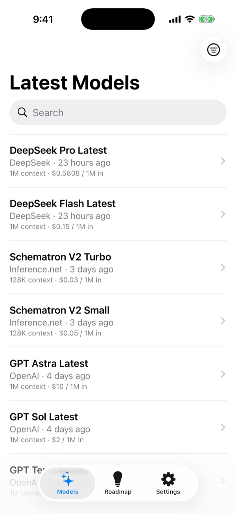
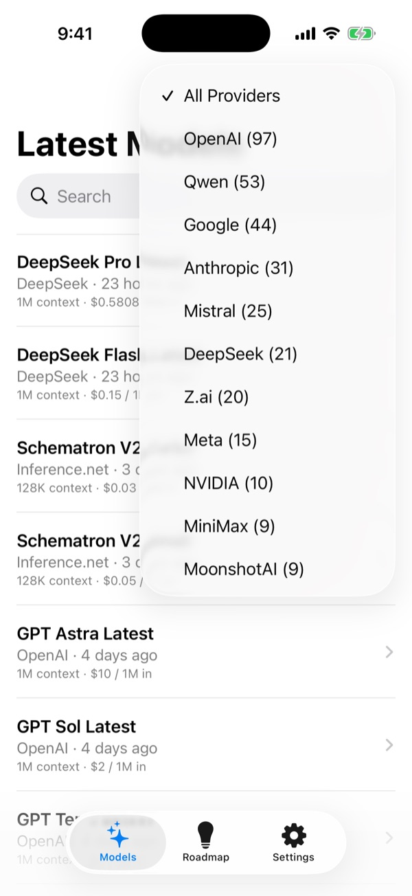
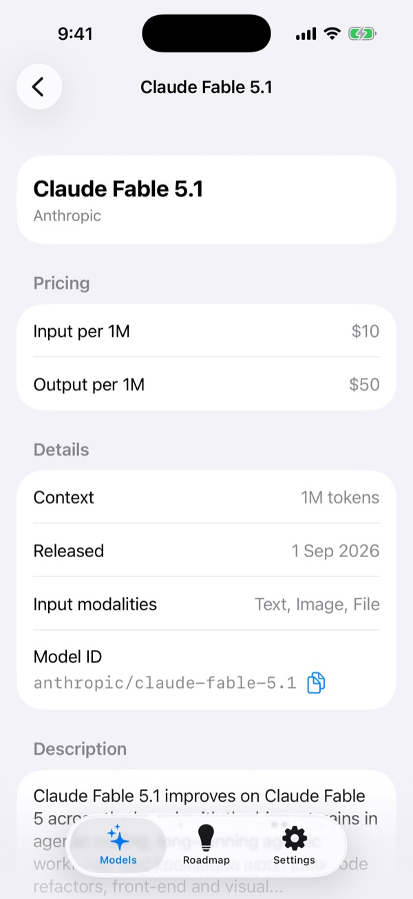
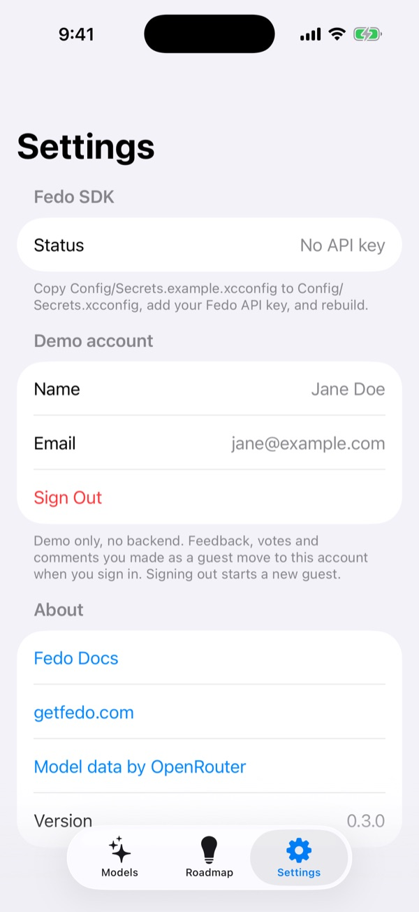
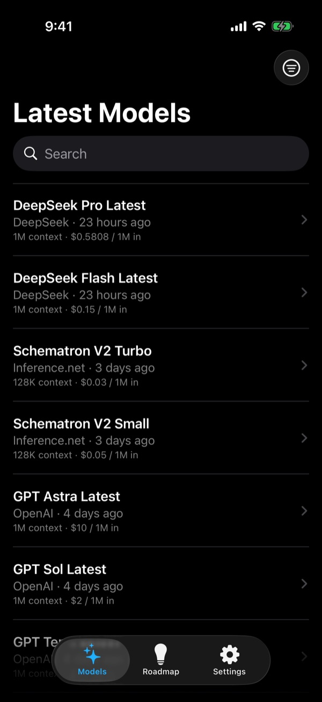
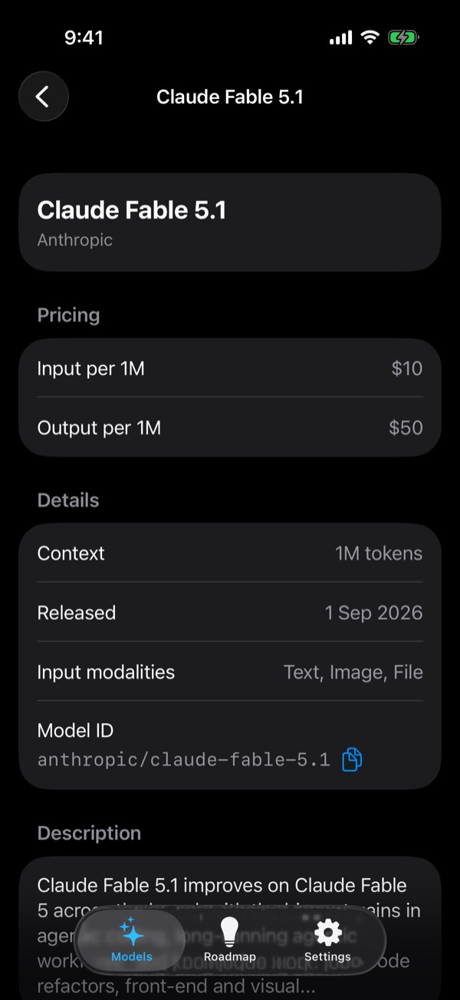

# ModelPulse — Fedo iOS SDK example

A small SwiftUI app that tracks the newest AI models and shows how to add in-app feedback and feature voting with the [Fedo iOS SDK](https://github.com/getfedo/fedo-ios).

[](https://github.com/getfedo/fedo-ios-example/actions/workflows/ci.yml)
[](LICENSE)


## What it shows

ModelPulse lists the newest AI models from the public [OpenRouter](https://openrouter.ai) models API (no key needed) and weaves Fedo into the moments where users naturally have something to say:

- **Latest Models**: newest models first, pull to refresh, search by name or ID, filter by provider.
- **Model detail**: pricing per 1M tokens, context length, release date, input modalities, copyable model ID and description.
- **Roadmap tab**: the full Fedo feedback board, where users browse, submit, vote on and comment on requests.
- **Contextual feedback**: request a missing model when a search finds nothing, or report a problem when models fail to load.
- **Settings**: demo sign-in and sign-out that set the Fedo user identity, plus the Fedo SDK status.

SwiftUI and Foundation only; FedoKit is the single dependency.

## Screenshots

| Latest models | Provider filter | Model detail | Settings |
| --- | --- | --- | --- |
|  |  |  |  |

<details>
<summary>Dark appearance</summary>

| Latest models | Model detail |
| --- | --- |
|  |  |

</details>

Captured on an iPhone 17 simulator without a Fedo API key.

## Requirements

- Xcode 26 or later
- iOS 16 or later
- Swift 6
- [FedoKit](https://github.com/getfedo/fedo-ios) `0.4.0-beta.1`, resolved by Xcode through Swift Package Manager

## Quick start

1. Clone the repository and create your local secrets file:

   ```sh
   git clone https://github.com/getfedo/fedo-ios-example.git
   cd fedo-ios-example
   cp Config/Secrets.example.xcconfig Config/Secrets.xcconfig
   ```

2. Set `FEDO_API_KEY` in `Config/Secrets.xcconfig` to your API key from the [Fedo dashboard](https://app.getfedo.com).
3. Open `fedo-ios-example.xcodeproj`, select the `fedo-ios-example` scheme and an iOS simulator, then run.

No key yet? The app still builds and runs: the models list and detail work, the Roadmap tab and Settings explain how to add a key, and the feedback buttons in the models list stay hidden.

## Where Fedo is used

| API | File | What it does |
| --- | --- | --- |
| `Fedo.initialize(apiKey:config:)` | [`fedo_ios_exampleApp.swift`](fedo-ios-example/fedo_ios_exampleApp.swift) | Initializes the SDK once at launch with the key from Info.plist, with debug logging in Debug builds. Skipped when no key is configured. |
| `FedoFeedbackView()` | [`ContentView.swift`](fedo-ios-example/ContentView.swift) | The Roadmap tab: the full feedback board. It pushes its own screens, so the tab wraps it in its own `NavigationStack`. |
| `.presentFedoCreateFeedback(isPresented:)` | [`ModelsListView.swift`](fedo-ios-example/ModelsListView.swift) | Opens the feedback submission sheet from "Missing a model? Request it" in the No Results state and "Report a Problem" in the load error state. Both buttons appear only when a key is configured. |
| `Fedo.setUserProperty("favorite_provider", value:)` | [`ModelsListView.swift`](fedo-ios-example/ModelsListView.swift) | Records the provider picked in the filter menu as a user property (last value wins). |
| `Fedo.setUserID(_:)`<br>`Fedo.setUserDisplayName(_:)`<br>`Fedo.setUserEmail(_:)` | [`SettingsView.swift`](fedo-ios-example/SettingsView.swift) | Demo sign-in: identifies the user. Feedback, votes and comments made as a guest move to the signed-in account. |
| `Fedo.logout()` | [`SettingsView.swift`](fedo-ios-example/SettingsView.swift) | Demo sign-out: clears the identity and starts a new anonymous user. |

The full SDK guide is in the [Fedo docs](https://docs.getfedo.com/next/guide/getting-started/).

## About the API key

Fedo API keys are client-side keys: they are meant to ship inside your app. This project embeds the key in the app's Info.plist at build time ([`Config/Info.plist`](Config/Info.plist) maps `FEDO_API_KEY` to `FedoAPIKey`), so anyone with the app binary can read it.

`Config/Secrets.xcconfig` is gitignored only to keep your key out of git and out of this public repository. Never paste keys in issues, pull requests or logs.

## Running tests

In Xcode, press Cmd+U. From the command line, run the same command CI runs:

```sh
xcodebuild test \
  -scheme fedo-ios-example \
  -destination 'platform=iOS Simulator,name=iPhone 17,OS=latest' \
  CODE_SIGNING_ALLOWED=NO
```

Pick any installed simulator for `name=`. The tests cover model decoding and formatters with an inline fixture; they need no network and no API key.

## Contributing

Contributions are welcome. See [CONTRIBUTING.md](CONTRIBUTING.md) for setup and guidelines, and follow the [Code of Conduct](CODE_OF_CONDUCT.md). Report security vulnerabilities privately as described in [SECURITY.md](SECURITY.md). Bugs in the SDK itself belong in [getfedo/fedo-ios](https://github.com/getfedo/fedo-ios/issues).

## Credits

Model data by [OpenRouter](https://openrouter.ai). This project is not affiliated with OpenRouter.

## License

This example is available under the [MIT License](LICENSE). FedoKit is distributed as a binary under its own license.

## Links

- Fedo: https://getfedo.com
- Documentation: https://docs.getfedo.com/guide/getting-started/
- iOS SDK: https://github.com/getfedo/fedo-ios
